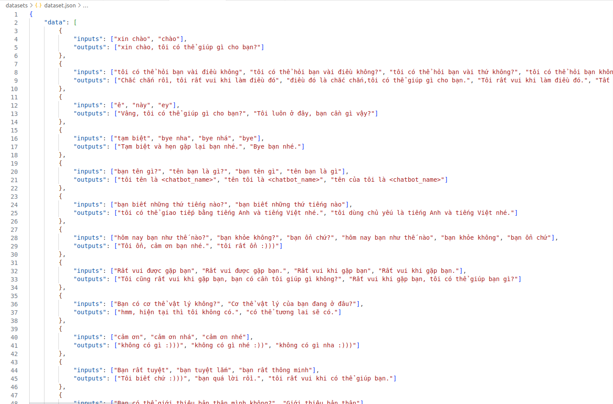

# Generative Pre - trained Transformer (GPT)
## 1. Model Architecture

## 2. Dataset Setup

## 3. Train Tokenizer and Pre-process Data
python3 preprocess.py --tokenizer_path {TOKENIZER_PATH} --dataset_paht {DATASET_PATH} --saved_data_path {SAVED_DATA_PATH}

## 4. Train Model
python3 train.py --data_path {SAVED_DATA_PATH} --tokenizer {TOKENIZER_PATH} --checkpoint {CHECKPOINT_PATH} --device {DEVICE} --epochs {NUM_EPOCHS} --batch_size {BATCH_SIZE} --mini_batch {MINI_BATCH}
